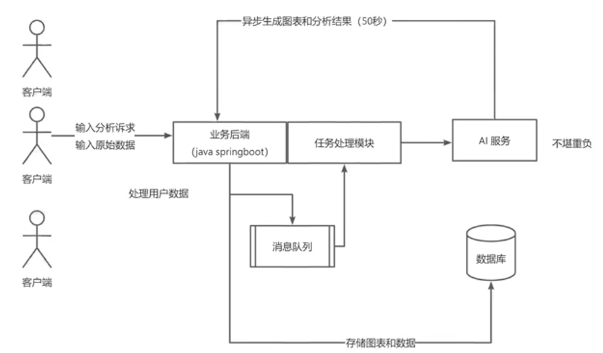

此分支master 是毕设优化分支
详情文档请看main分支  https://github.com/nanchengcyu/TechMindWave-frontend/tree/main

-----------------------------
相关笔记链接🔗 
南城余：https://www.yuque.com/g/nanchengcyu/dubfny/ibwmnan5bo9uf51x/collaborator/join?token=wkxCKWCK5Lt3BlsI&source=doc_collaborator# （**项目不断完善，持续更新中**！） 

### 技术栈
前端
1. React
2. Umi+Ant Design Pro
3. 可视化开发库 Echart
4. Umi openapi(自动生成后端接口调用代码)
   后端
1. Spring Boot
2. MySQL
3. Redis
4. MyBatis Plus
5. RabbitMQ
6. AI 能力
7. Easy Excel
8. Swagger + Knife4j 项目接口文档
9. Hutool工具库

### 架构图

